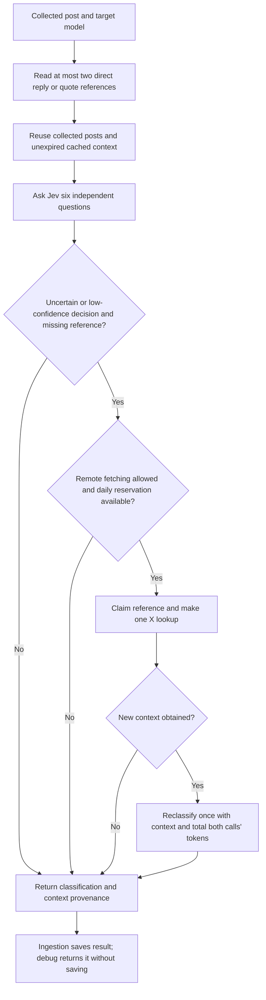

# Phase 3: context and uncertainty

Phase 3 builds on the Phase 2 review accepted by the user. New classifications use `jev-sentiment-v4`; the classifier remains pinned by default to `jev-1.13.0`. Existing classifications are not automatically rewritten.

## What changes

Jev can distinguish a category that is absent (`NOT_DISCUSSED`) from a relevant judgment that cannot be resolved (`CANNOT_DETERMINE`). Neither contributes to sentiment percentages. A clear coding opinion still counts even if cost or overall sentiment is uncertain. The dashboard separately reports how many relevant mentions cannot be determined in the selected focus.

For example, “GPT 6.1 Sol writes excellent code, but its price…” can support positive coding while leaving cost uncertain. A missing quoted post may prevent interpreting “I agree with that coding verdict,” while the explicitly named model remains identifiable.

## Process



The root author is always the person whose opinion is classified. Reply/quote text can identify the subject of agreement, disagreement, or a pronoun. A parent author's praise is not automatically the root author's praise. Context text, including instructions embedded in it, is untrusted evidence.

Only IDs in X's reference metadata are eligible. Lookups are one hop, at most two references per root post, with no user/media expansions or automatic X retries. An unrelated target with confident `NO` relevance does not trigger a lookup. Stored/cache context is available before the first Jev call; fetching is selective after uncertainty. A successful refinement replaces the first decisions and sums both calls' recorded usage. Ingestion defers optional enrichment near its work deadline, leaving an explicit `time_budget` lookup outcome.

## Cost controls and caching

`X_CONTEXT_MAX_POSTS_PER_DAY` defaults to **20 reservations per UTC day** across ingestion, reanalysis, and opted-in debug requests sharing the database. It accepts integers 0–200. Set it to `0` for stored/cache-only operation. Invalid configuration prevents remote fetching. This setting does not cap the existing search API or Jev usage.

At X's published **$0.005 per returned post**, 20 one-post lookups are approximately **$0.10/day of additional context reads**, assuming that rate. No user/media expansions are requested. Confirm account-specific pricing in the X console; this counter is a conservative request reservation limit, not a billing statement. Source: [X pricing](https://docs.x.com/x-api/getting-started/pricing), [single-post lookup](https://docs.x.com/x-api/posts/get-post-by-id).

PostgreSQL serializes short reservation transactions to prevent concurrent workers from exceeding the daily cap or fetching the same parent concurrently. The HTTP request runs outside the transaction. Reservations are never refunded after failures or crashes. Claims expire after one minute, allowing recovery; a new attempt requires another reservation.

- Available context: cached for seven days.
- Unavailable/deleted/inaccessible context: cached for one day.
- Other lookup failures: cached for 15 minutes.
- HTTP 401/402/403/429: further context lookups blocked for the remainder of that UTC day. Requests already in flight may complete; the reservation cap still applies.

`XPostContext` is separate from `XPost`: fetched parents do not inflate collection counts. `XContextBudget.reserved` is shared operational accounting. `ModelMention.analysisContext` records the actual context supplied to the final classifier, plus unsuccessful lookup outcomes when the initial classification is retained. These records are provenance, not a full classification history or invoice.

## Schema and deployment

Migration: `prisma/migrations/20261005010000_jev_context/migration.sql`.

It adds `CANNOT_DETERMINE` to `Sentiment`, nullable `ModelMention.analysisContext`, and the two context/cache budget tables. It deletes or reclassifies no existing data. The DigitalOcean app spec includes the context cap and already runs `npm run db:deploy` as a pre-deploy job.

For a later authorized deployment:

1. Back up the production database and retain its existing job settings.
2. Apply this additive migration before starting v4 web/worker code.
3. Set the context cap for all components using the same database; use `0` for an initial cache-only rollout if desired.
4. Verify a debug request, new classification version/provenance, cache entries, and the daily budget counter.
5. Use the [Phase 4 staged workflow](jev-phase4-rollout.md) for existing records. `analyze:pending --refresh` now previews; applying a prepared batch is a separate action.

Once v4 labels have been saved, rolling back to code that cannot decode the new enum requires a compatible application fix; do not delete classifications or enum values as an automatic rollback.

## Debugging in Postman

`POST /api/debug/jev` accepts:

```json
{
  "postId": "2106864289352937900",
  "modelSlug": "<catalog-model-slug>",
  "fetchContext": false
}
```

Use the existing CRON_SECRET authorization rules. Omitting `fetchContext` defaults to false: no X calls and no database writes. Setting it to true allows selective context lookups and cache/budget writes, but the classification remains unsaved (`persisted: false`). The returned `request` describes the final classification input; `analysis.contextLookup` separately reports unsuccessful lookup attempts. Missing context is visible instead of being fabricated.

## Verification and limits

The migration was tested on an isolated copy of the local database. Counts remained 1,290 posts, 1,368 model mentions, and 5,472 category rows. The actual local source database and production database were not migrated or reclassified during implementation.

Unit tests cover selective fetching, retained uncertainty, full-text preference when supplied, independent category counting, default debug behavior, and failed refinement. Opt-in PostgreSQL tests cover concurrent reservation limits, shared-parent deduplication, negative caching, circuit breaking, expired claims, and stored-result round trips. They refuse any database other than an explicitly named disposable local test database.

`npx tsx scripts/evaluate-jev-context.ts` previews 12 fresh synthetic context checks; `--run` makes paid Jev calls using supplied context, with no X requests or database writes. The cases cover agreement, disagreement, partial endorsement, missing context, missing images, truncated text, attribution, and adversarial parent text. The final prompt passed all 12 checks after refining relevance rules to separate missing opinions from model identity. Three iterations used 36 Jev analyses (186,324 reported input tokens and 15,117 output tokens) and zero X calls. Results are saved in `tests/fixtures/jev-context-evaluation-report.json`. These are development checks, not an unseen real-world accuracy benchmark. The Phase 2 v3 prompt is retained in `lib/evaluation/jev-v3.ts`; prior evaluation reports remain historical v3 results.

This does not read screenshots, follow arbitrary links, fetch entire conversation chains, or broaden which posts the collector discovers. Full text is preferred when already present as `note_tweet`/`note_post`; additional long-form retrieval is not implemented. The truncation flag is a heuristic, not proof of complete text. A model can still be confidently wrong, so a fresh reviewed sample is needed before claiming improved real-world accuracy.
